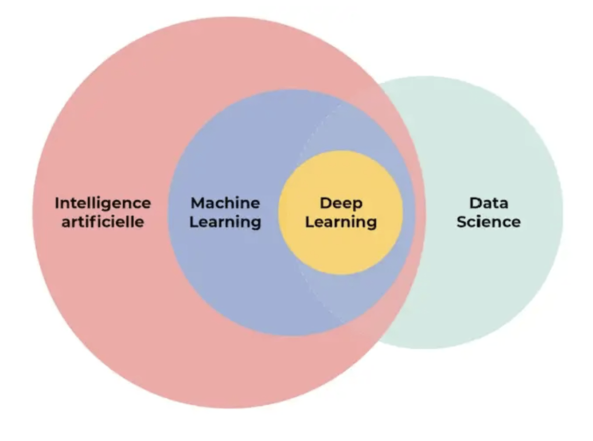

# Introduction to Machine Learning
AI: To create an application which can perform it's own task without any human intervention.  
ML: It provides stat tools to analyze, visualize, predict, and forecasting the data.  
DL: Subset of ML that mimics the human brain.  
DS: Used ML, DL, or AI to make decisions.  

# Types of Machine Learning
## Supervised Machine Learning
A type of machine learning where the model learns from labeled data, using input-output pairs to make predictions or classify new data.
### Regression: Predicts countinous outcomes
### Classification: Predicts discrete outcomes
## Unsupervised Machine Learning
A type of machine learning where the model learns patterns and structures from unlabeled data without predefined outputs.
### PCA: Reduces dimentionality while retaining key information
### Clustering: Groups similar data points
## Reinforcement Learning
Agents learn to make decisions by interacting with the environment to maximize cumulative rewards.  

# Instance based Learning vs Model based Learning
## Instance-Based Learning:
Memorizes the training data and makes predictions based on comparisons (e.g., nearest neighbors).  
Advantage: Simple and effective for smaller datasets.  
Limitation: Computationally expensive during prediction and prone to overfitting.  
## Model-Based Learning:
Builds a general model using the training data and makes predictions based on the learned model (e.g., linear regression).  
Advantage: Efficient for large datasets and can generalize well.  
Limitation: Requires proper tuning and assumptions about the data.  

